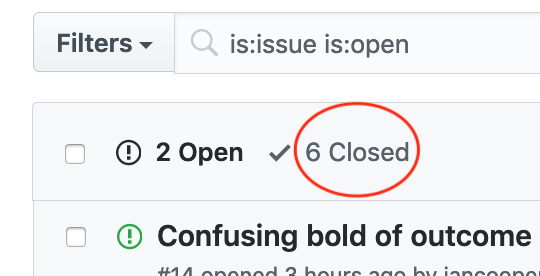
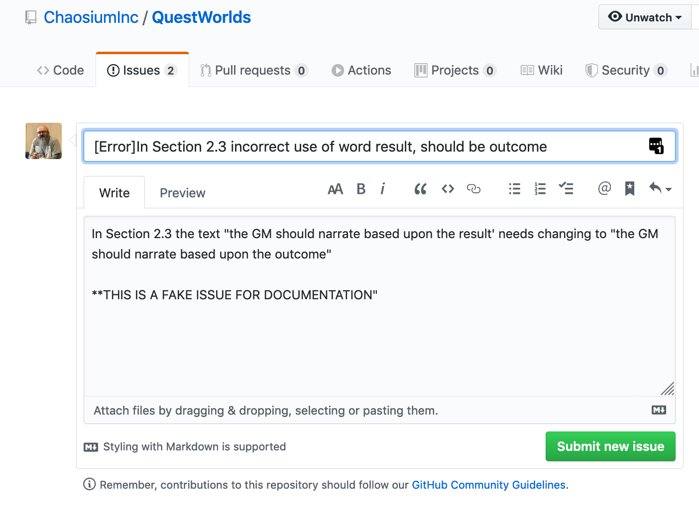

# Raising An Issue

The simplest way to contribute to this project is to raise an issue.

An useful issue is usually one of three types:

* An error - there is a problem with the text, such as a typo, mis-numbered header, table missing a column, incorrect bolding of a game term etc.
* A fix - there is a problem with the rules, and you are offering a correction. Normally, a change request should relate to internal inconsistency in the rules.
* An enhancement - the rules could be improved with a change or addition.
* Housekeeping - an issue related to the repository itself

## How to raise a PR

## Step-By-Step

 Go to the Chaosium QuestWorlds Github Repository at: https://github.com/ChaosiumInc/QuestWorlds

 Navigate to the Issues Tab

 On the Issues Page use the New Issue button to add your issue. Complete the title **and** a description of the issue. Please see the guidelines below on how to raise an issue successfully.

### Review existing issues first

Your issue may already have been raised by someone else, and be under discussion. Please review the list of open and closed issues. You can review the closed issues by clicking on 'Closed' in the bar above the issues.

Please don't re-submit issues that have been closed previously, and re-open them only if you have new information to add to an issue that was rejected.

### Pick a clear title

We will tend to scan through open issues to prioritize those that we need to deal with. You can help us by making the issue as clear as possible in the title. Include the section of the rules and a pithy summary of the issue, not the detail.

To be really helpful, you could indicate which type of issue you believe this is [Error, Fix, Enhancement or Housekeeping].

### Provide detail in the description

This is where you help us fix the problem, and you should provide as much detail as is necessary. Usually, two to three short paragraphs should be enough to raise an issue. If you find yourself writing several pages of text, it's likely that you are should think twice, try to summarize and provide more information in any follow up with the team.

### Be as helpful as you can

The QuestWorlds rules are partitioned into numbered sections. That makes it easy for us to refer to a rule's location across multiple formats: web, PDF, RTF, etc. Please don't assume that we know where the text that you are referring to is located. Tell us the section(s) so that we can find it.

If there is insufficient information on your Issue, we may comment to that effect, and take no further action until you provide the missing information.

Try to provide:

* The text that you believe needs correction
* An explanation of why you believe it needs correction
* (Optionally) Any suggestions you have for how to fix it.

Please note that if you submit a suggested new wording in your issue, you are explicitly granting us rights to include your text, verbatim if we so desire, or edited if not, in the SRD. If you can't agree to that, don't make a suggestion, just report the issue and let us figure out how to effect any changes required.

### Submit your issue

Once you are done, don't forget to submit your issue.

## What to expect

If you raise an issue, we will review it and decide how to act. We may add a label to indicate what that action is, and we may add a comment as to our proposal. Alternatively, we may reject the issue, and we will endeavor to  why we rejected it.

### Expect Labels, Assignees and Comments

We will:

* Categorize your issue with a label.

### Etiquette

It is possible for issues to become 'hot', particularly if we reject your proposal. Please be kind. If we cannot see your point of view now, have the grace to walk away and hope that in future we may come to understand your point better. You can't win them all. Abuse will not be tolerated.

## Fork and Raise a Pull Request

Taking your contributions directly requires us to have you sign a Contributor License Agreement. Before we reach that point, we would rather discuss your proposal in an issue. If we agree that it needs resolution, we may choose to fix, to maintain a consistent voice in the document. You may offer to fork and submit a PR, but please don't be offended if we tell you that we intend to fix it ourselves and get you to review.

If you are not on our list of those who have signed a CLA, we will have to reject your PR without further review.

It is most likely that you would be invited to sign a CLA and raise a PR because you are another publisher and we have discussed adding your content to the SRD.

Please, come and raise an issue first.
